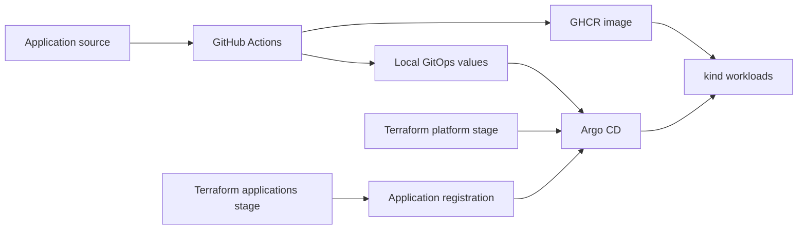

# OpenTelemetry Demo on Local Kubernetes

A local platform engineering lab for deploying the upstream OpenTelemetry Demo
with **kind, Terraform, Helm, Argo CD, and GitOps**. It provides a local counterpart
to an AWS EKS implementation, with separate infrastructure and application
ownership and a repeatable path from a source commit to a Kubernetes deployment.

## Engineering focus

The application is the upstream OpenTelemetry Demo. This project's focus is the
platform and delivery workflow around it:

- Separate Terraform stages install platform services and register the Argo CD Application.
- Argo CD owns application workloads and reconciles a dedicated GitOps repository.
- Gateway API and NGINX Gateway Fabric provide local HTTP routing.
- Validation scripts check routing, application delivery, and real telemetry data.
- A local release path uses commit-tagged GHCR images; direct kind image loading supports development.

## Architecture

Terraform owns platform setup and Application registration. Argo CD owns the
OpenTelemetry workloads. The local delivery path uses GHCR and a separate
GitOps repository from AWS.

## Start here

| Goal | Guide |
|---|---|
| Understand the complete project | [AWS and local walkthrough](docs/PROJECT_WALKTHROUGH.md) |
| Explore the architecture | [Architecture](docs/ARCHITECTURE.md) and [AWS comparison](docs/AWS_VS_LOCAL.md) |
| Build or operate the local environment | [Operations guide](docs/OPERATIONS.md) |
| Understand image delivery choices | [Image workflow](docs/IMAGE_WORKFLOW.md) |
| Inspect telemetry and troubleshoot | [Observability](docs/OBSERVABILITY.md) and [troubleshooting](docs/TROUBLESHOOTING.md) |

The operations guide covers prerequisites, the fresh-cluster sequence, GitHub
credentials and package visibility, validation, and teardown. Read it before
running the lifecycle commands.

## Validation and implementation notes

[CI](.github/workflows/ci.yml) checks Terraform formatting and configuration,
YAML syntax, shell syntax, and GitHub Actions workflows. These static checks
are separate from deployment validation.

The [validation scripts](scripts/) check cluster and platform readiness,
application health, routing, the Recommendation image, and observability.
`make observability-soak` runs a 15-minute check for backend restarts and OOMs.
See the operations guide for commands and expected evidence; the presence of
these checks does not itself establish a currently running deployment.

The local overlay applies resource limits to observability services. It disables
the optional `flagd-ui` editor sidecar following an arm64 OOM investigation;
the `flagd` evaluation service stays enabled. The investigation and tradeoffs
are documented in [troubleshooting](docs/TROUBLESHOOTING.md).

## Related repositories

| Repository | Responsibility |
|---|---|
| This repository | Local cluster, platform bootstrap, and Application registration |
| [otel-demo-gitops-local](https://github.com/lackito/otel-demo-gitops-local) | Local Helm values and Gateway resources |
| [otel-demo-gitops](https://github.com/lackito/otel-demo-gitops) | AWS desired state |
| [otel-demo-apps](https://github.com/lackito/otel-demo-apps) | Application source and release workflows |
| [otel-demo-infra-aws](https://github.com/lackito/otel-infra-aws) | AWS infrastructure and platform provisioning |

The application source repository is needed for the custom Recommendation build
and release paths. See the operations guide for the exact dependencies.
